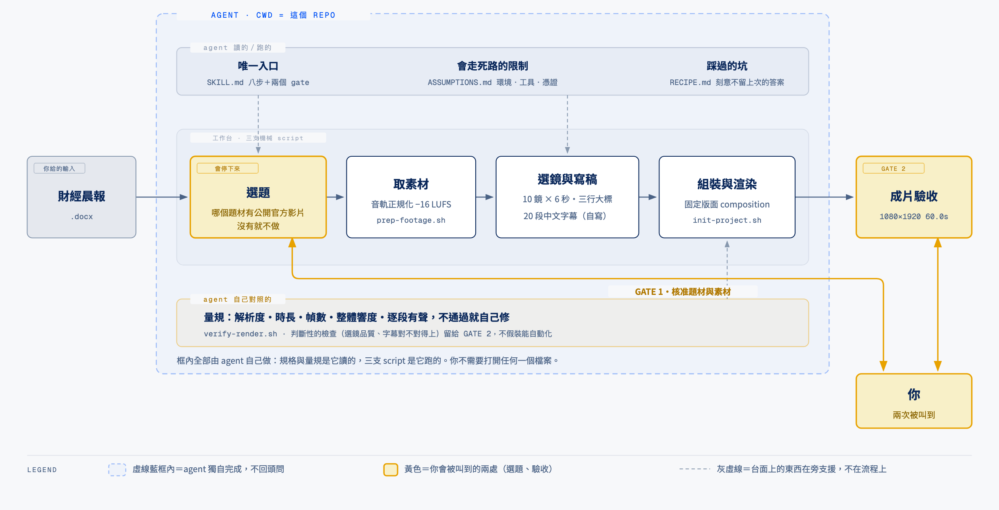
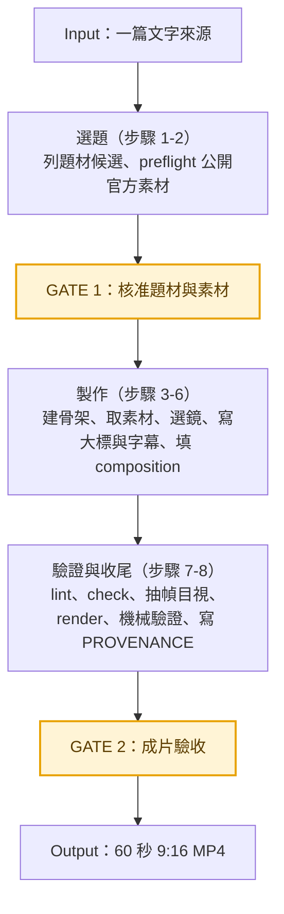

# sourced-footage-reel

讀一篇文字來源，挑出**有公開官方影片可用**的技術題材，取得那支素材，剪成 60 秒的 9:16 直式短影音。
**什麼都不生成**——不生圖、不做主播、不做旁白。

**要解決的問題**：技術題材的短影音，素材通常沒人有。用素材庫的通用畫面，畫面跟講的東西對不上；
用 AI 生圖，一個關於真實產品的事實主張配一張生成的圖，那張圖本身沒有可信度。
**而被討論的那家公司，自己就在官網放著品質很好的產品影片，沒人用。**

找不到公開官方素材的題材就不做：**那是邊界，不是失敗。**

這個 repo 是**方法本體**，不帶狀態、不存成片，所有產出寫到輸入指定的 `run_dir`。
本機不需要常駐副本，要用再拉回來：

```bash
git clone https://github.com/WilliamCHIU-ETH/sourced-footage-reel-harness.git
```

## 它怎麼運作



**這張圖怎麼看**：**虛線藍框內全部是 agent 在做。** 你交出一份文字來源，agent 在框裡讀規格、跑三支 script、對照量規。
**它會在兩個地方叫你**：選題（哪個題材值得做、這支官方影片能不能用）與成片驗收（選鏡品質與字幕對不對得上）。
**那兩件機器量不出來，其餘它自己判斷後繼續。**

台面上那兩層（規格與方法／量規）**都是 agent 讀的，不是給你看的**。你不需要打開任何一個檔案。

## 從一篇來源到一支成片

八個步驟、兩個常態 checkpoint。**只有建骨架、取素材與驗成片是 script；選題、選鏡、寫字幕都是判斷**，
寫在 [`SKILL.md`](SKILL.md) 的文字步驟裡，不在 script 裡。



各階段實際做什麼，以及哪些是機器、哪些是人：

| 流程圖中的階段 | 在這裡實際做什麼 | 機械還是判斷 |
| --- | --- | --- |
| **選題（1-2）** | 從來源挑技術題材，逐個查是否有公開官方影片可實際取得；產出 `candidates.json` | **全部是判斷**，沒有 script。素材可取性的欄位與值域定義在 `inputs.schema.json` 的 `$defs.candidate` |
| **製作（3-6）** | `init-project.sh` 建 HyperFrames 骨架並釘版本、放品牌資產；`prep-footage.sh` 取素材、音軌正規化到 −16 LUFS、產 contact sheet；接著選鏡、寫三行大標與 20 段字幕、填 `fixtures/composition-template.html` | **取素材是機械，選鏡與寫稿是判斷。** contact sheet 的格距通常小於鏡長，一格好看不代表整段都好 |
| **驗證（7）** | `lint` → `check` → `snapshot` 抽幀目視 → `render` → `verify-render.sh` | **機械為主。** `check` 0 error **不代表成片有聲音**，它不檢查音軌 |
| **收尾（8）** | 寫 `PROVENANCE.md`：素材來源、規格、取得方式、授權狀態 | 機械 |

一支成品固定是：**60.0 秒、1080×1920、10 個鏡頭各 6 秒、20 段字幕**，保留素材原聲並正規化到 −16 LUFS。

**字幕與素材原聲刻意各自獨立**——素材是英文原聲，字幕是中文自寫，兩者不對齊也不翻譯。
那不是偷懶：硬做中文配音會蓋掉原廠的產品演示聲，而硬翻字幕會讓字幕受制於原片的敘事節奏。

## 怎麼跑

harness 不帶狀態，所有產出寫到輸入指定的 `run_dir`，不寫進這個資料夾。
**三支 script 都吃旗標、不讀那份 JSON**——JSON 是給 agent 的輸入契約，值由 agent 讀出來帶進去。

```bash
cp fixtures/inputs.minimal.json my-run.json   # 填題材、素材、大標、字幕、run_dir

# 步驟 3：建骨架（釘 HyperFrames 版本、放品牌資產）、取素材（正規化音軌、產 contact sheet）
bash bin/init-project.sh --run-dir <run_dir> --project-id <topic>-<date> \
     --logo <logo.png> --font-bold <bold.ttf> [--font-regular <regular.ttf>]
bash bin/prep-footage.sh --out <run_dir>/project/assets --sheet <run_dir>/shots \
     --url <素材 URL> [--referer <來源網站>] [--lufs -16]

# 步驟 4-6：選鏡、寫大標與字幕、填 composition —— 判斷工作，看 SKILL.md

# 步驟 7：lint / check / snapshot / render 之後，機械驗成片
bash bin/verify-render.sh <成片路徑> --width 1080 --height 1920 \
     --duration 60 --fps 30 --shot-seconds 6
```

⚠️ `verify-render.sh` **不帶參數就會套 1080/1920/60/30/6 的預設值而誤判**，輸入用了非預設值時一定要傳。
三支都支援 `--help`。

`fixtures/inputs.example.json` 是一支**已完成的成品**，用來對照欄位格式。
**不得當作新題材的底稿或答案**——照抄它等於交出上一支的答案。它裡面的絕對路徑指向作者機器上的另一個 repo，clone 下來要自己改。

## 兩個會停下來的地方

整條線只有兩個常態 checkpoint，其餘不確定一律自己判斷後繼續：

| | 停在哪 | 為什麼要人 |
|---|---|---|
| **GATE 1** | 題材與素材挑選 | 「哪個題材值得做」與「這支官方影片能不能用」是編輯與授權判斷 |
| **GATE 2** | 成片驗收 | 選鏡品質與字幕是否對得上畫面，機器量不出來 |

另有一個**條件式**的：選鏡時可用鏡頭撐不起指定片長才觸發——片長是呼叫方指定的輸入，不可自行更改。

**理由留到下一個 gate 一併出示，不要每遇到一件不清楚的事就停一次。**

## 怎麼判定做對了

機械部分 `bin/verify-render.sh` 全包（[`VERIFY.md`](VERIFY.md) 有完整清單，含 render 前的 lint／check／抽幀）：

| 項目 | 判準 |
|---|---|
| 解析度 | 等於輸入的 width × height |
| 時長 | 與 `duration_seconds` 相差 < 0.1 秒 |
| 幀數 | 等於 duration × fps |
| 音訊串流 | 必須存在 |
| 平均音量 | `mean_volume` 落在 −22 ～ −16 dB |
| 逐段有聲 | 每段鏡頭中點各量 4 秒，全部不得為靜音 |

**「逐段有聲」是被一次事故逼出來的**：整體響度合格的片子，單一鏡頭仍可能是靜音段。

人眼的部分（選鏡是否對得上字幕、大標是否溢框、字幕有沒有自行推論的數字）列在 `VERIFY.md`，不假裝能自動化。

## 當前資料夾結構

這個 repo 只放**方法**：規格、三支機械 script、輸入定義與模板，以及兩份史料。成片與中間產物都不在這裡。

```text
sourced-footage-reel-harness/
├── SKILL.md                      ← 唯一入口：八個步驟與兩個 gate
├── CLAUDE.md                     ← agent 開場：任務型態、三件先知道的事
├── ASSUMPTIONS.md                ← 環境／工具／憑證假設，有幾條不知道會走死路
├── VERIFY.md                     ← 完整判準，含人眼項目
├── RECIPE.md                     ← 歷次軌跡與踩過的坑（史料，刻意不留答案）
├── inputs.schema.json            ← 輸入定義，以及 $defs.candidate
├── bin/
│   ├── init-project.sh           ← 建專案骨架、釘 HyperFrames 版本、放品牌資產
│   ├── prep-footage.sh           ← 取素材、音軌正規化、產 contact sheet
│   └── verify-render.sh          ← 成片機械驗證
├── fixtures/
│   ├── inputs.minimal.json       ← 開新題材用的底稿（無題材值）
│   ├── inputs.example.json       ← 已完成成品，只對照欄位格式
│   └── composition-template.html ← 固定版面的 composition 模板
├── docs/
│   ├── architecture.html         ← 架構圖原始 SVG
│   └── architecture.png          ← README 用的匯出圖
└── exploration/                  ← 2026-08-30～31 來源層探索的史料與證據
```

| 想查看的內容 | 位置 |
| --- | --- |
| 要怎麼做一支片（唯一入口） | [SKILL.md](SKILL.md) |
| 會走死路的環境限制 | [ASSUMPTIONS.md](ASSUMPTIONS.md) |
| 輸入要填什麼欄位 | [inputs.schema.json](inputs.schema.json)、[fixtures/inputs.minimal.json](fixtures/inputs.minimal.json) |
| 上次踩過哪些坑、還會不會再遇到 | [RECIPE.md](RECIPE.md) |
| 題材入口怎麼來、為什麼停在那裡 | [exploration/README.md](exploration/README.md) |

跑起來之後，**產出全部落在輸入指定的 `run_dir`，不回寫這個 repo**：

```text
<run_dir>/
├── candidates.json      ← 步驟 1-2 的候選與素材 preflight
├── shots/               ← contact sheet 與抽幀
├── PROVENANCE.md        ← 素材來源、規格、取得方式、授權狀態
└── project/             ← HyperFrames 專案
    ├── index.html
    ├── assets/          ← logo、字型、footage.mp4、audio-normalized.m4a
    └── renders/         ← 成片
```

## 刻意不做的事

不生成任何畫面（無 AI 生圖、無生成式 B-roll）、不做主播或虛擬人、不做多支素材混剪、不做旁白配音、不做競品分析。
**找不到公開官方素材的題材就不做**——這條線的價值建立在「畫面是真的、而且是原廠自己拍的」。

## 兩份史料為什麼這樣寫

[`RECIPE.md`](RECIPE.md) 記錄實際執行的順序、卡住的地方、繞道方式，以及人在哪裡介入——
**但題材名、素材識別碼、字幕文字都被移除了。**

原因是冷啟動驗收發現：只要 RECIPE 寫著「這份文件的正確候選是 X 與 Y」，
任何 agent 都能**不讀來源文件**就交出看起來正確的 GATE 1 候選表，驗收因此失效。

所以那份文件只留**方法與現象**。裡面每一則 incident 都附「下次還會遇到嗎」——
例如 YouTube 匿名下載已失效（需要 PO Token），那是平台端封鎖，不會自己好。

[`exploration/`](exploration/README.md) 是同一個道理的另一份：2026-08-30～31 那輪在找「題材入口能不能不靠人工餵 DOCX」，
結論、證據與失敗紀錄都在，但**來源狀態會變**，不要把裡面的候選當現成答案。

## 要改這份 harness 的話

**再加東西前先問「不寫進去，下一個 agent 會不會做錯」——答案是不會的，就不要加。**

`SKILL.md` 與 `ASSUMPTIONS.md` 是每次必讀的熱路徑，
它們的**成長速率本身就是一個指標**（上一輪 +7.8%，用這條規則複驗後收回到 +6.0%）。
